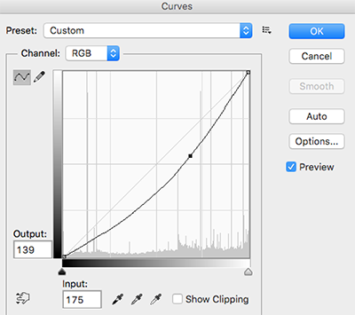

# PhotoFiltersSDK

PhotoFiltersSDK aims to provide fast, powerful and flexible image processing instrument for creating awesome effects on any image media. 

Library supports OS on API 15 and above.


## Features
PhotoFiltersSDK processes filter on any Image within fraction of second since processing logic is in NDK. At present following image filters are included: 

* **[ToneCurveSubfilter](#tonecurve) :** With this powerful filter you can change RGB channels of any image to create great results.
* **[SaturationSubfitler](#saturation) :** Used for changing color saturation of an image.
* **[ColorOverlaySubfilter](#coloroverlay) :** As name suggests you can overlay any image with color of your choice.
* **[ContrastSubfilter](#contrast) :** Used for changing contrast value of image.
* **[BrightnessSubfilter](#brightness) :** To change brightness levels.
* **[VignetteSubfilter](#vignette) :** To apply vignette effect on image. 

Library also comes with inbuilt Sample Filters (Refer [SampleFitlers.java](photofilterssdk/src/main/java/com/zomato/photofilters/SampleFilters.java)). Implementation is straightforward: 

```java
Filter fooFilter = SampleFilters.getBlueMessFilter();
Bitmap outputImage = fooFilter.process(inputImage);
```

## Implementation

### Adding Dependency

Simply add Dependency on artifact in your `build.gradle` : 

```gradle
dependencies {
    compile 'com.github.zomato:androidphotofilters:1.0.1'
    ...
```

**OR** 

Copy|Paste  photofilterssdk from the repo to your project and include photofiltersdk in your `settings.gradle` like this :

```gradle
include ':photofilterssdk'
```
Add dependency in your `build.gradle` :

```gradle
compile project(':photofilterssdk')
```

### Usage

Load native library in your activity :

```java
public class MainActivity extends AppCompatActivity {
    static
    {
        System.loadLibrary("NativeImageProcessor");
    }
    ...
```

then

```java
Filter myFilter = new Filter();
myFilter.addSubFilter(new BrightnessSubFilter(30));
myFilter.addSubFilter(new ContrastSubFilter(1.1f));
Bitmap outputImage = myFilter.process(inputImage);
```

Above code snippet will give you outputImage with increased brightness and contrast. You can further refer [example project](example).

## Documentation
Although there are few inbuilt filters already present, you may want to create and customize one specific to your need and show your creativity. For that you would require to know how all the Subfilters can be used. Let me take you through all of them.

### <a name="tonecurve"></a>ToneCurveSubfilter
This is most awesome filter present in this library which differentiates **PhotoFiltersSDK** from other image processing libraries out there. ToneCurveSubFilter applies the changed RGB Channel curve to create effect on image.



Here is the code snippet the apply the above RGB curve on an image : 

```java
Filter myFilter = new Filter();
Point[] rgbKnots;
rgbKnots = new Point[3];
rgbKnots[0] = new Point(0, 0);
rgbKnots[1] = new Point(175, 139);
rgbKnots[2] = new Point(255, 255);
       
myFilter.addSubFilter(new ToneCurveSubfilter(rgbKnots, null, null, null));
Bitmap outputImage = myFilter.process(inputImage);
```

The results are nearly same as we would see in photoshop and other tools. We can also specify knots for Red, Green and Blue channels (in the ToneCurveSubfilter's constructor).

### <a name="saturation"></a>SaturationSubfilter
This fitler can be used to tweak color saturation of an image. Here is the example : 

```java
Filter myFilter = new Filter();
myFilter.addSubFilter(new SaturationSubfilter(1.3f));
Bitmap outputImage = myFilter.process(inputImage);
```

SaturationSubfilter takes float as an argument and has no effect for value 1.

### <a name="coloroverlay"></a>ColorOverlaySubfilter
Increases the specified red, green and blue values for each pixel in an image.

```java
Filter myFilter = new Filter();
myFilter.addSubFilter(new ColorOverlaySubfilter(100, .2f, .2f, .0f));
Bitmap outputImage = myFilter.process(inputImage);
```

### <a name="contrast"></a>ContrastSubfilter
To change the contrast levels of an image use this filter : 

```java
Filter myFilter = new Filter();
myFilter.addSubFilter(new ContrastSubfilter(1.2f));
Bitmap outputImage = myFilter.process(inputImage);
```

ContrastSubfilter takes float as an argument where value 1 has no effect on the image.

### <a name="brightness"></a>BrightnessSubfilter
As the name suggest, this filter is used for changing brightness levels : 

```java
Filter myFilter = new Filter();
myFilter.addSubFilter(new BrightnessSubfilter(30));
Bitmap ouputImage = myFilter.process(inputImage);
```
BrightnessSubfilter takes int as an argument where value 0 has no effect. Negative values can be used to decrease brightness of the image.

### <a name="vignette"></a>VignetteSubfilter
This filter can be used to put vignette effect on the image. 

```java
Filter myFilter = new Filter();
myFilter.addSubFilter(new VignetteSubfilter(context, 100));
Bitmap outputImage = myFilter.process(inputImage);
```

VignetteSubfilter takes int as an argument whoes value ranges from 0-255, which defines intesity of the vignette effect.

## License
This library falls under [Apache v2](LICENSE)
